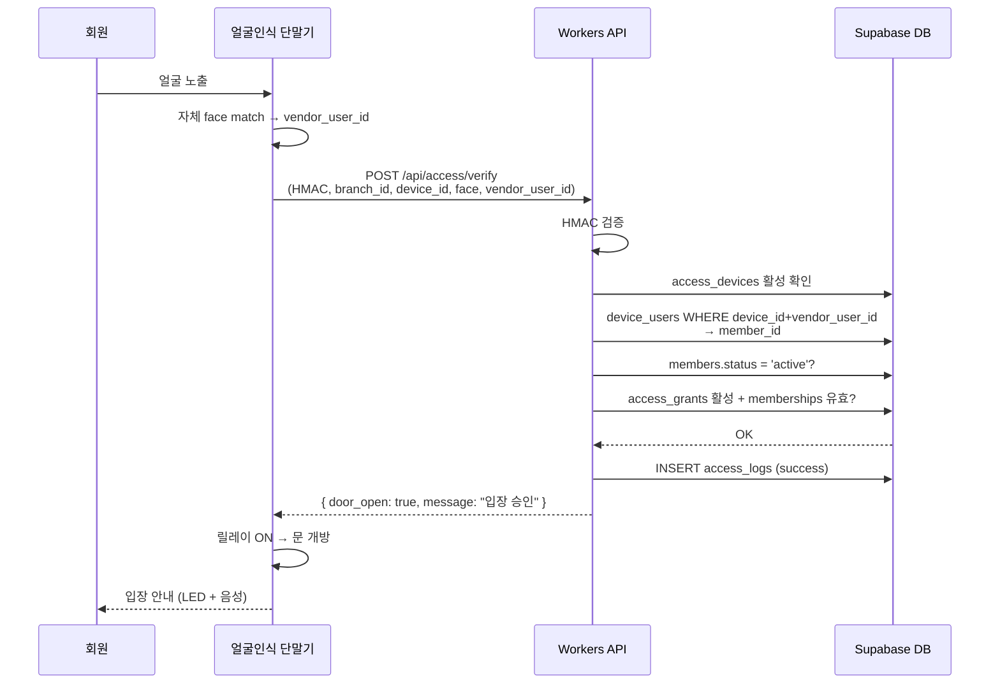
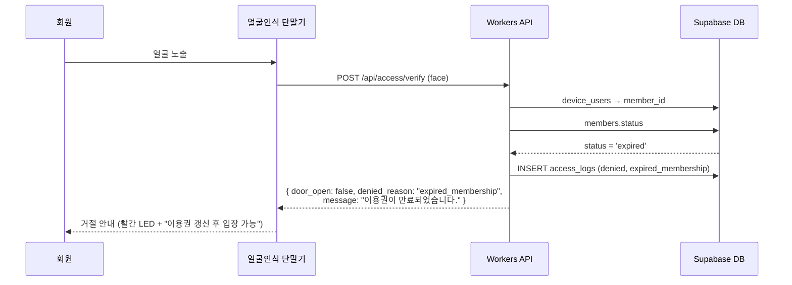
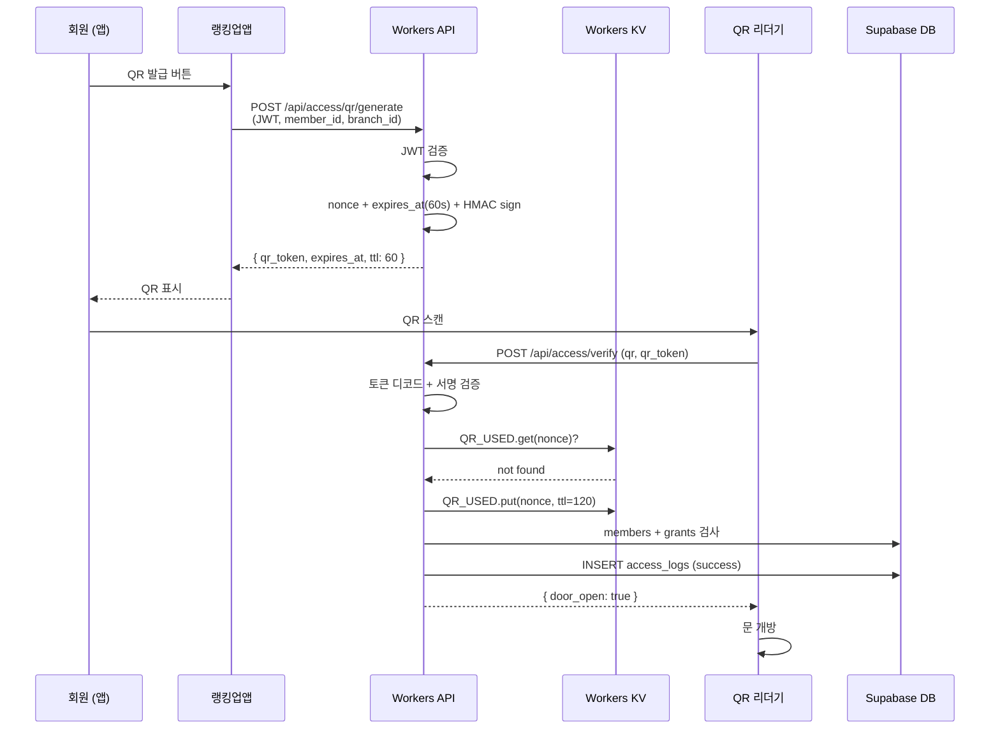
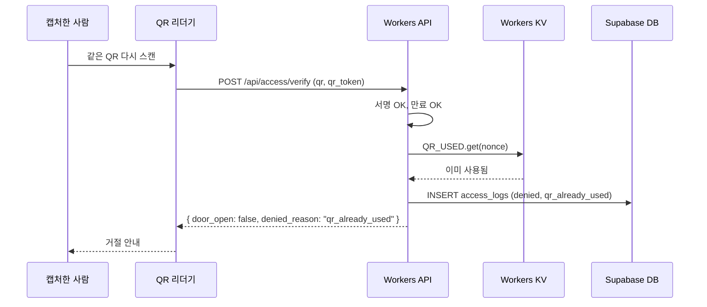
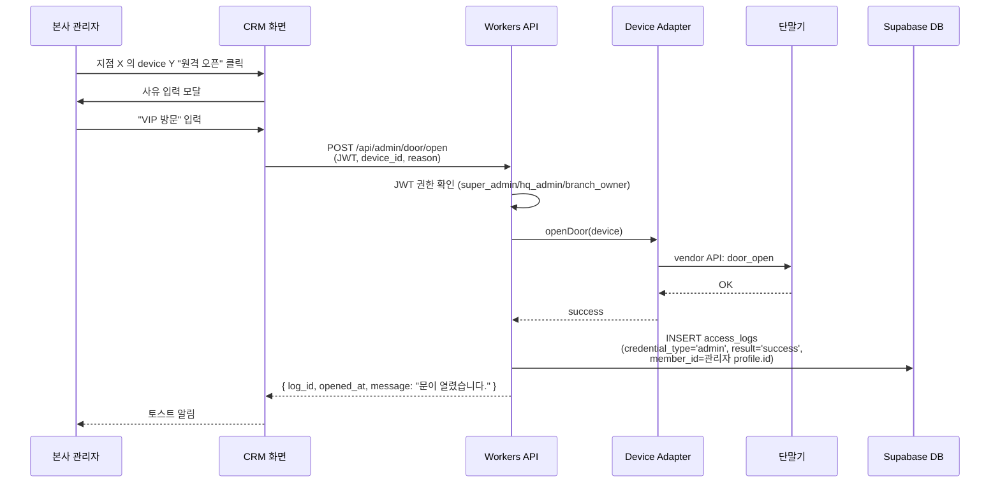
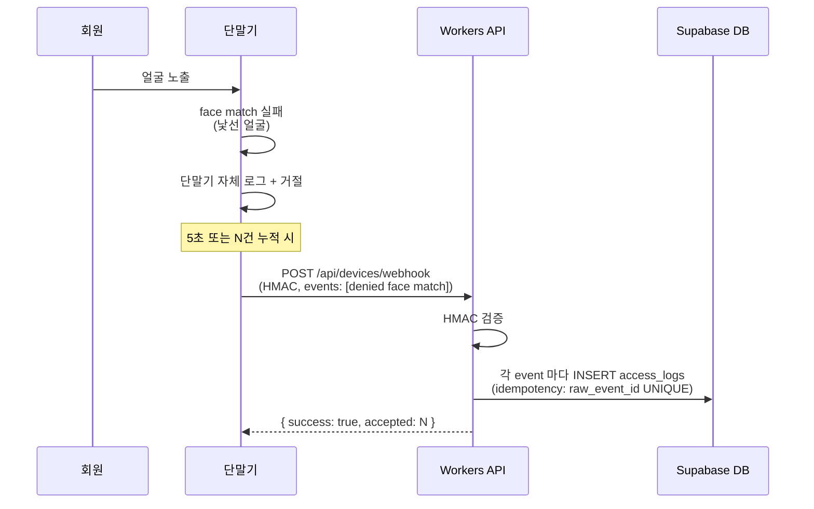
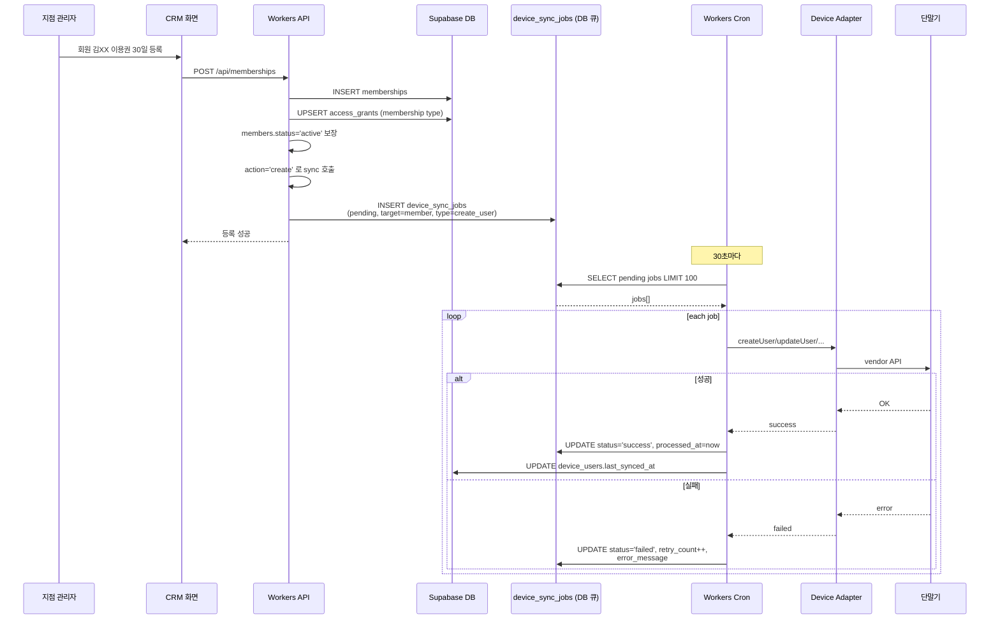

# 03. 출입 흐름도

> Phase 1 산출물 #5 — 시퀀스 다이어그램 (mermaid)
> 작성일: 2026-04-28

---

## 1. 시나리오 요약

| # | 시나리오 | credential | 결과 |
|---|---|---|---|
| A | 정상 회원 얼굴인식 입장 | face | success |
| B | 만료 회원 얼굴인식 시도 | face | denied (expired_membership) |
| C | 랭킹업앱 QR 입장 | qr | success |
| D | QR 캡처 재사용 시도 | qr | denied (qr_already_used) |
| E | 관리자 원격 오픈 | admin | success |
| F | 단말기가 자체 거절 후 webhook | webhook | denied (단말기 측 결정) |
| G | 이용권 등록 → 단말기 동기화 | sync | async |

---

## 2. 시나리오 A — 정상 회원 얼굴인식 입장

응답 시간 목표: p95 < 300ms (단말기→Workers→DB→응답).

---

## 3. 시나리오 B — 만료 회원 얼굴인식 거절

`unpaid`, `suspended`, `trial_max_used` 도 동일 패턴, denied_reason 만 다름.

---

## 4. 시나리오 C — 랭킹업앱 QR 입장

---

## 5. 시나리오 D — QR 캡처 재사용 거절

토큰 만료(60초) 후라면 같은 흐름에서 `qr_expired` 로 거절. 두 검사 모두 통과해야 입장 가능.

---

## 6. 시나리오 E — 관리자 원격 오픈

---

## 7. 시나리오 F — 단말기 자체 거절 → webhook

**중요:** webhook 은 단말기 자체 결정의 **사후 보고**. CRM 측 verify 거절은 시나리오 B 와 같이 실시간 응답 안에서 로깅됨.

---

## 8. 시나리오 G — 이용권 등록 → 단말기 동기화 (비동기)

**재시도 정책:**
- `retry_count < 5` 면 다음 cron 에서 자동 재시도
- 5 도달 시 `status='failed'` 고정 + 관리자 대시보드에 표시
- 관리자가 수동 "강제 동기화" 시 retry_count 0 으로 리셋 후 재실행

---

## 9. 데이터 정합성 보증

| 위험 | 대응 |
|---|---|
| 동일 QR 토큰이 두 단말기에서 거의 동시에 스캔 | KV `put-if-not-exists` 또는 Postgres UNIQUE INSERT 로 race 방지 |
| 출입 후 단말기 응답 유실 → 다시 스캔 | webhook idempotency (raw_event_id UNIQUE) |
| 단말기 sync 실패가 누적 | device_sync_jobs.failed 카운트가 임계값 넘으면 device.status='error' 로 자동 전환 |
| 이용권 만료 시점 = 정확히 자정 | 매일 00:00 cron 으로 `memberships WHERE end_date < today` → status='expired' + sync_job INSERT |

---

**다음 문서:** [04-device-adapter.md](./04-device-adapter.md) — 하드웨어 추상화 인터페이스
